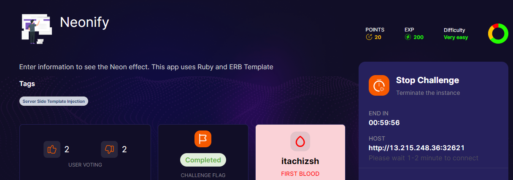
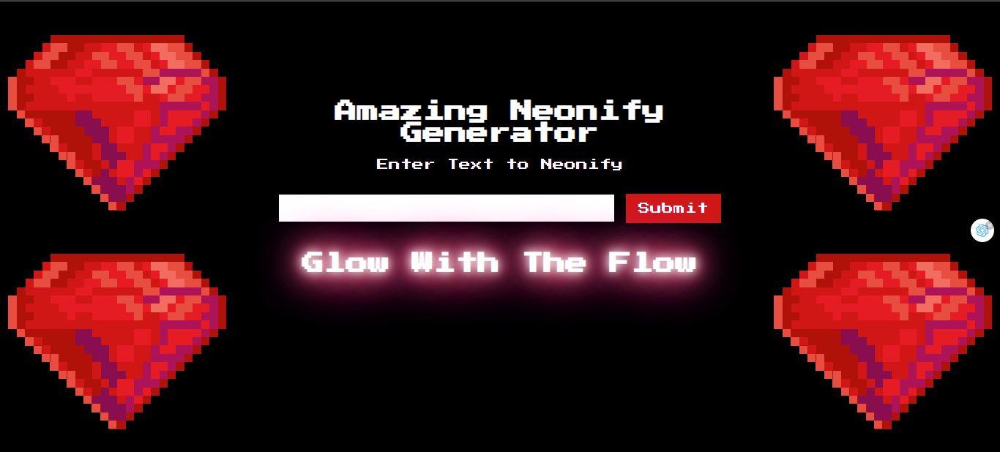
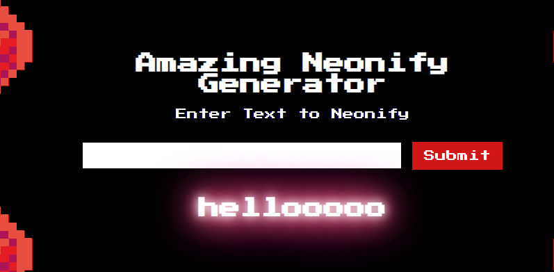
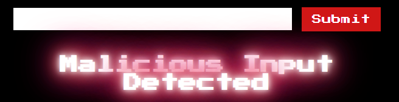
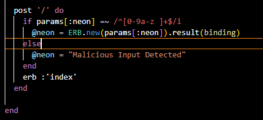
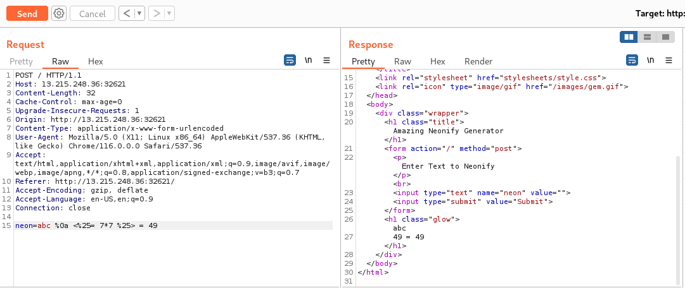
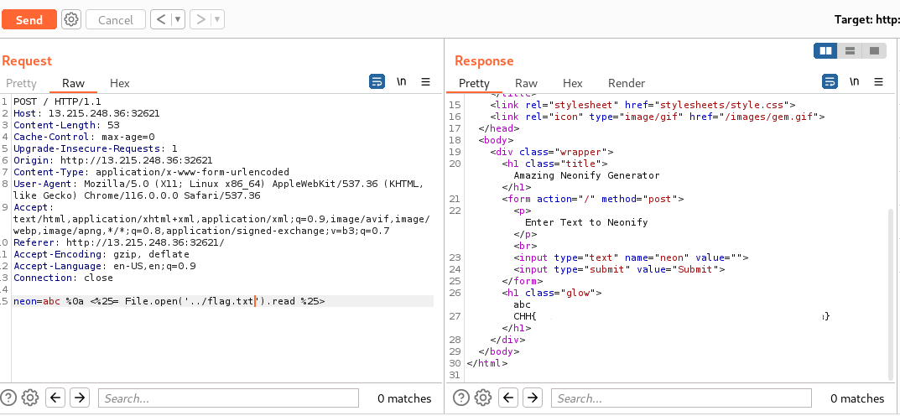

## CHALLENGE: NEONIFY 

Hellooooo, lại là thêm 1 bài ctf tới từ Cookie Arena đâyyy ~~~~



Đập vào mắt là một trang khá là đẹp, xịn xò con bò



Mỗi lần chúng ta nhập một cái gì đó thì nó sẽ hiện lên trên trang -> có thể sẽ inject payload để lấy được thông tin ??



Ở phần giới thiệu thì tác giả cũng đã cho chúng ta đó là lỗi SSTI, app dùng Ruby và ERB Template.

Nhưng sau tui search trên [Hack trick](https://book.hacktricks.xyz/pentesting-web/ssti-server-side-template-injection) thì đúng là có payload để đặt đó, nhưng có vẻ web đã chặn những kí tự lạ 



Sau khi thử encode các payload vẫn không được :))) bố mày nhịn mày lâu lắm rồi nhớ!!!

Ngồi tra google thì thấy ở HackTheBox(HTB) có một bài tương tự như thế này (giống y xì luôn ớ   ) :))) wtf mannnn, nhưng ở HTB họ có cho source code luôn.



Nói cho dễ hiểu thì đoạn này dùng regex, chỉ cho phép nhập chữ với số thôi, còn những kí tự còn lại thì chuyển xuống là Malicious input.

Sau một hồi research, cũng như tham khảo wu thì biết được regex của Ruby hơi khác với ngôn ngữ lập trình khác [source](https://brakemanscanner.org/docs/warning_types/format_validation/)

Nghĩa là chỉ cần làm dòng đầu đúng và dòng sau cho nó xuống dòng thì bypass được. Kí tự xuống dòng của Ruby ```%0a```
Hãy thử payload ```abc %0a <%25= 7*7 %25> = 49```
    ```
Lưu ý: 1/ Nếu đặt input ở browser không được thì chuyển qua burpsuit
       2/ Cần phải encode kí tự ```%``` vì server báo lỗi, chuyển thành kí tự ```%25```
    ```  


Tới đây chỉ cần dump ra flag nữa là được, dùng payload ```abc %0a <%25= `ls ` %25>``` để liệt kê ra file, nếu không thấy file flag thì tìm ở thư mục cha của thư mục hiện tại.

Payload ```abc %0a <%25= File.open('../flag.txt').read %25>``` dump ra được flag và kết quả là



## Bài học từ challenge

Với tui thì bài này vừa hay mà vừa không hay. Vì bài này giống với bài Neonify trùng tên bên HTB nhưng ở cookie lại không cho source code(cũng có thể đây là ý đồ của tác giả, để đánh lừa or challenge người chơi hơn), nhưng tui học hỏi được rất nhiều, biết thêm về Ruby cũng như mở rộng kiến thức về SSTI, nếu bài này có source code sẵn thì khỏe, hoặc với những người biết về Ruby chắc sẽ đỡ gặp khó khăn hơn, cũng có thể là tui còn non và xanh nên chưa hình dung được bộ lọc nó như thế nào :)))) Nhưng mà hôm nay học thêm được một điều mới, một kĩ thuật tấn công mới, hê hê.

## THANK YOU FOR LEARNING, GUYS

## PATIENCE IS THE KEY, SO KEEP TRYING EVERYDAY, LUV U <3