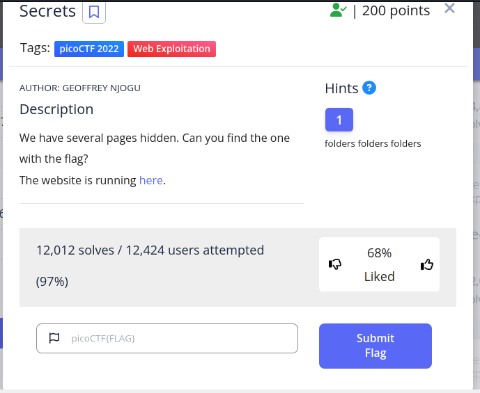
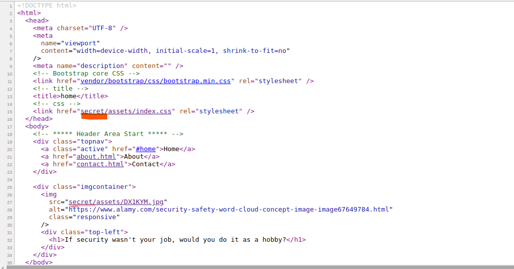
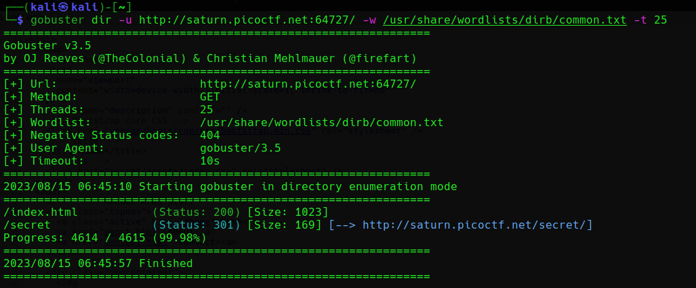
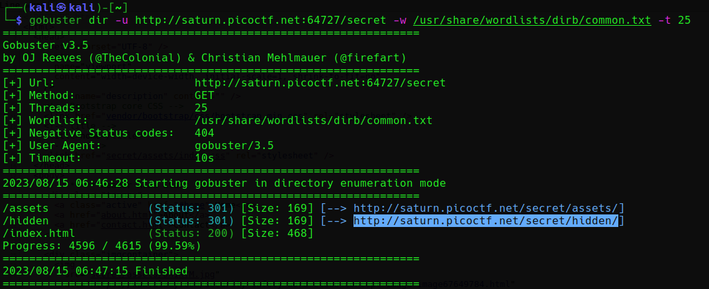
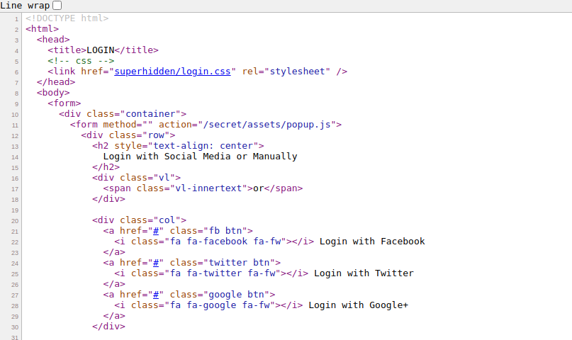
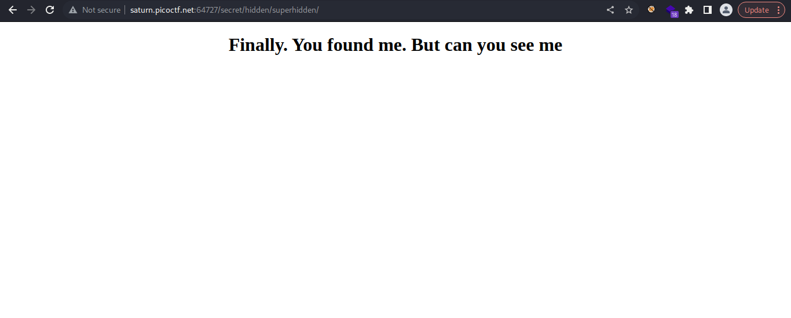
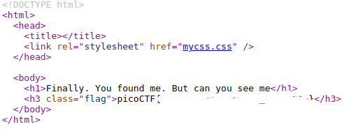

## Challenge: Secrets

When I view the source, I found an interesting information.

which this information and the hint, I decide to burte force directory of the page.

and countinue ....

after found /secret/hidden/ I cannot detect any information. But with the hint, I think may be when we view it on the browser, maybe we will have some way.
And view the source one more time, and we have...

Going to the page and we found the flag....

Oh, wait, actually not :))), but when you view the page, the flag will be there.
And the flag is.....

# DO IT BY YOUR SELF BRO :)))

THANK YOU FOR LEARNING, GUYS.
PATIENCE IS THE KEY.