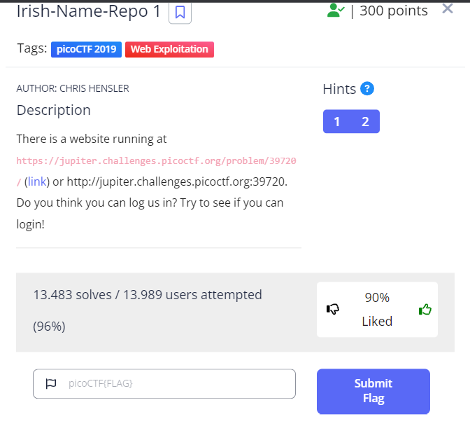
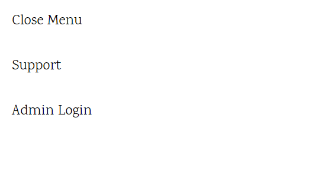
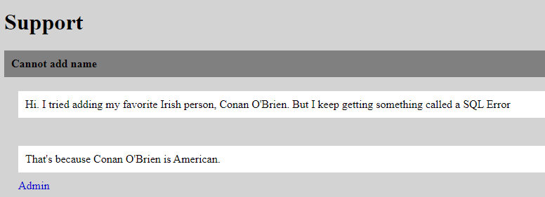
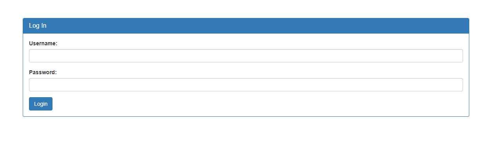
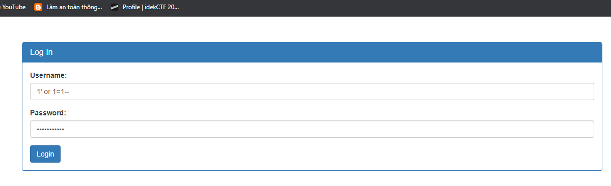
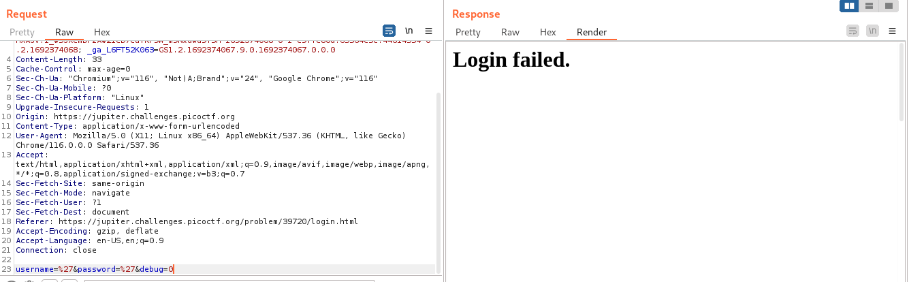
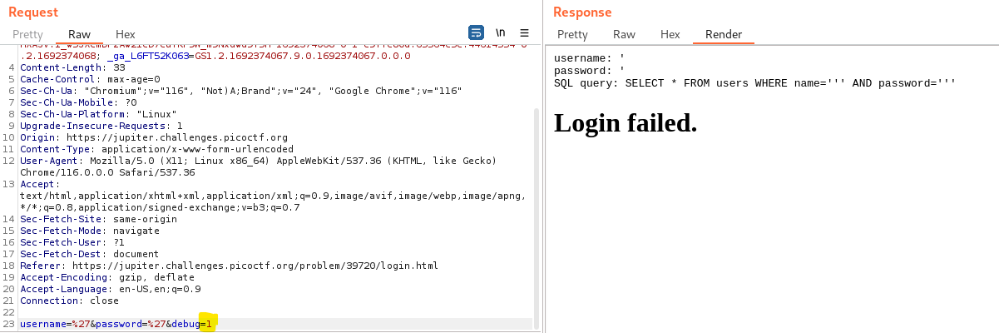
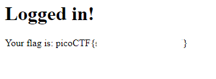

## CHALLENGE: Irish-Name-Repo 1
This is a very easy challenge using SQLi to bypass the login page.

When I browsing the website, I found the menu sidebar on top right in the page.

Let's view the ***support*** page. In here, I found the interesting comment.

When the person input ***Conan O'Brien*** the system calles SQL error. Do you see the single quote (')? -> So I guess the website contains SQL injection.

Now, let's visit the login page.

We know that, the page contains SQL injection, so let's try the payload: `1' or 1=1--` to bypass the authentication.

Or if you use the Burp Suite, enter the single quote (') in the username and password. We just recived the messange Login Failed.

You see the ***debug*** value is 0, what if we change it into 1?
And booooom, we can see the syntax error -> we know how the input fetch in the query and we can use right payload to bypass.

This step is to make sure which payload is appropriate, rather we use brute force. The payload above is correct.

And now, we found the flag.

Damn bro, it's such an easy challenge right! :)))) 

THANK YOU FOR LEARNING GUYS.

PATIENCE IS THE KEY, SO KEEP TRYING EVERYDAY. LUV U <3
