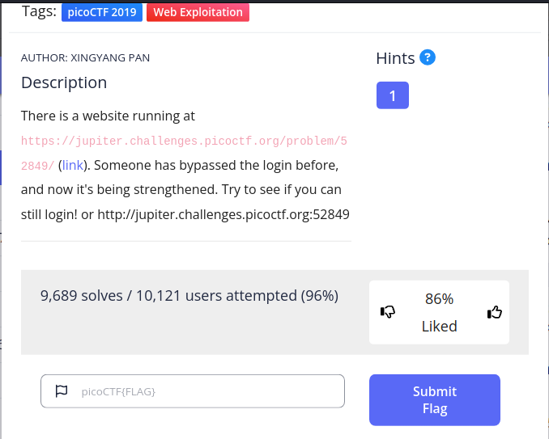
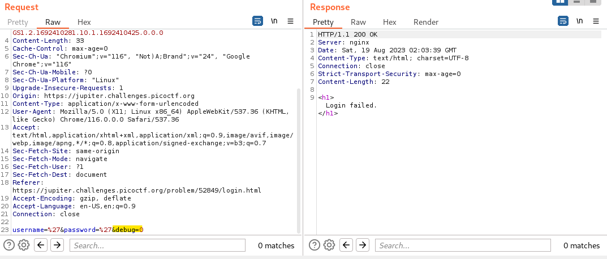
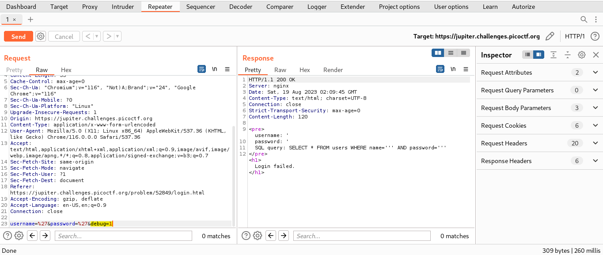
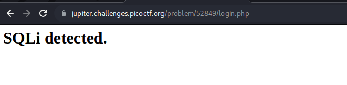
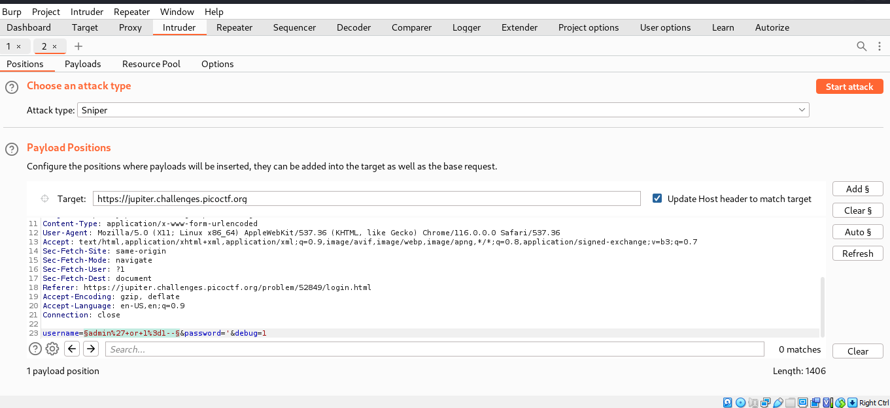
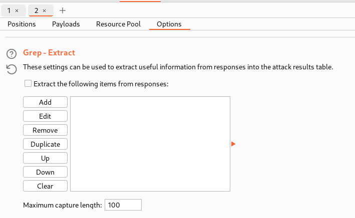
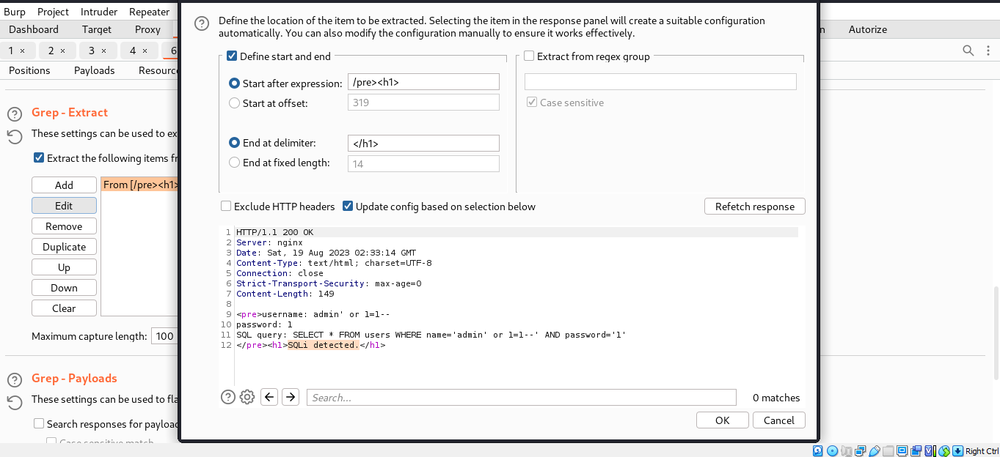
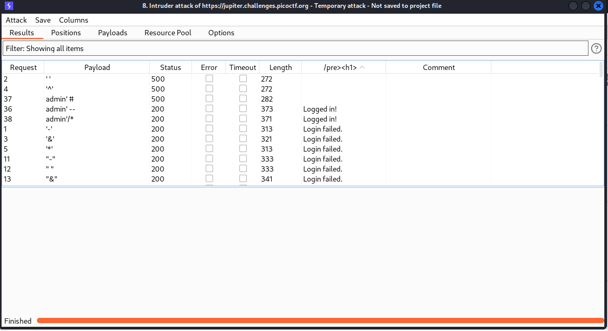
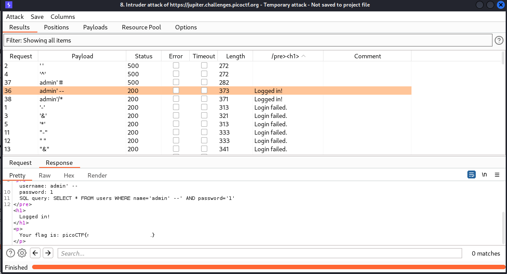

## CHALLENGE: Irish-Name-Repo 2

This challenge is similar to Irish-Name-Repo 1, we need to use SQL injection payload to bypass the authentication in Admin login page.

The first payload I use is single quote `'`, the page returns the message Login Failed.
But if we use Burp Suite, we can see in the request has `debug` paramater.

What if we change the value to 1?
Sending the request to Repeater and change `debug = 1`

And now we can see that the page returns the SQL error syntax. 
The first payload I used is `admin' or 1=1--` but the page retunrs SQLi detected message.

So now, I decide to burte force.
Send the request to Intruder and clear $.
Add $ in the username, and we have like this.

I found this [github page](https://github.com/payloadbox/sql-injection-payload-list#sql-injection-auth-bypass-payloads) contains SQL injection Authen bypass payloads.

To filter the result, we use `Grep-Extract` at Options.

Click add and then you will see the response, and then hightlight the content you want and `OK`.

And start attack, after few seconds we will see the results, and sort it in the `Grep-Extract` feild.

Now we view the response of `Logged in` and we found the flag.

THANK YOU FOR LEARNING GUYS.

PATIENCE IS THE KEY, SO KEEP TRYING EVERYDAY. LUV U <3