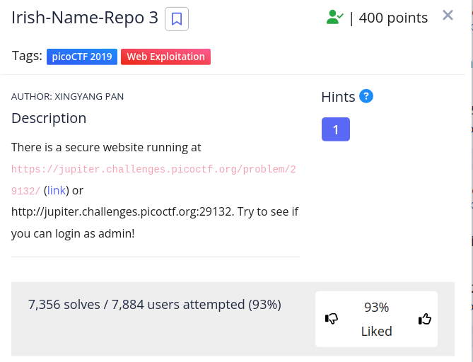
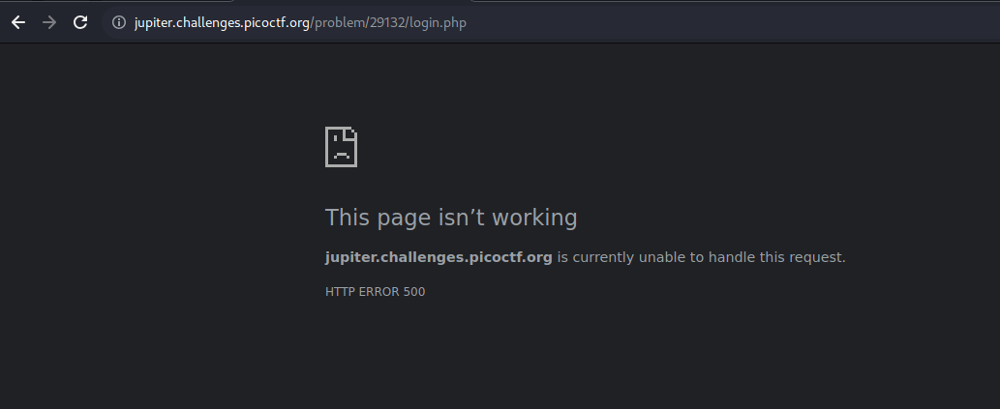
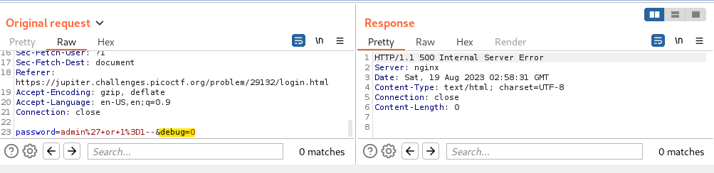
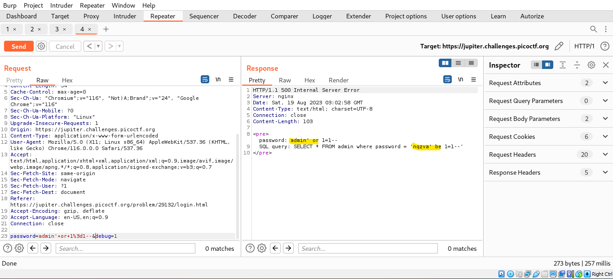
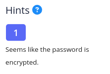
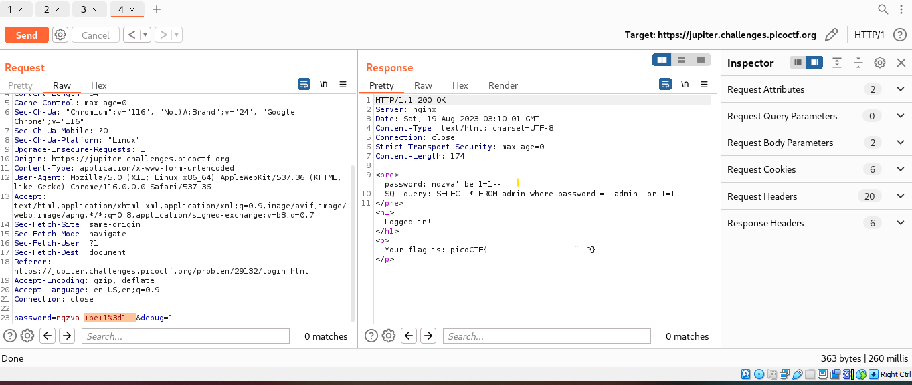

## CHALLENGE: Irish-Name-Repo 3

This challenge is similar to the previous 2 challenges, we will use the SQL injection to bypass the authentication.
For me, this challenge is easier than Irish-Name-Repo 1 and 2.

The first payload use is `admin' or 1=1--` and I recived the 500 response code.

So we use Brute Suite to capture the request and see does anything interesting.
In the request, we can see the `debug` parameter, let's send it to Repeater and change the value to 1.

Ah ha, the enter `admin' or 1=1--` but the query is change `nqzva' be 1=1--` -> I guess the password field is encrypted.
And the hint says the same

And now, nothing much to do, we just enter the encrypt payload `nqzva' be 1=1--` in the password.

Congrats, you found the flag. This challenge is so easyyyyyyyy.

THANK YOU FOR LEARNING GUYS.

PATIENCE IS THE KEY, SO KEEP TRYING EVERYDAY. LUV U <3
